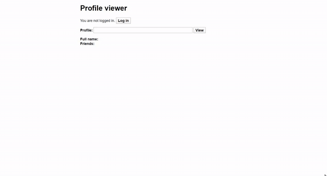

# Een Solid login met profile viewer maken.

## **Beschrijving**
Je leert hoe je een simpele login met profile viewer gebaseerd op Solid kunt maken.
Technieken die hier bij horen zijn HTML, CSS, Javascript & jQuery.
Een officiële, uitgebreide stap voor stap tutorial gemaakt door Solid zelf is [hier](https://solid.inrupt.com/docs/app-on-your-lunch-break) te vinden.

&nbsp;

## **Waarom?**
Het maken van een login gebaseerd op Solid helpt ons inzichten te geven hoe Solid werkt en welke mogelijkheden er zijn.


&nbsp;

## **Wat is Solid?
Solid is een framework waarmee applicaties op een gedecentraliseerde wijze geschreven kunnen worden. Kortom, je privacy is in eigen handen.

&nbsp;

## **Stappen**
Begin met een nieuw directory aan te maken en stop daar de volgende files in:

&nbsp;


&nbsp;

Maak in 'scripts' een main.js bestand aan en stop de jquery.js file erin om gebruik te maken van jquery.
Maak in 'styles' een main.css bestand aan om de alignment en opmaak van de elementen vast te stellen.
&nbsp;

Voeg de volgende code toe aan ```index.html```.
```<!doctype html>
<html lang="en">
<head>
  <meta charset="utf-8">
  <title>Profile Viewer</title>
  <link rel="stylesheet" href="styles/main.css">
</head>
<body>
  <h1>Profile viewer</h1>
  <p id="login">
    You are not logged in.
    <button>Log in</button>
  </p>
  <p id="logout">
    You are logged in as <span id="user"></span>.
    <button>Log out</button>
  </p>
  <p>
    <label for="profile">Profile:</label>
    <input id="profile">
    <button id="view">View</button>
  </p>
  <dl id="viewer">
    <dt>Full name</dt>
    <dd id="fullName"></dd>
    <dt>Friends</dt>
    <dd>
      <ul id="friends"></ul>
    </dd>
  </dl>
  <script src="scripts/jquery.js"></script>
  <script src="scripts/solid-auth-client.bundle.js"></script>
  <script src="scripts/rdflib.min.js"></script>
  <script src="scripts/main.js"></script>
</body>
</html>
```
Met deze code maken we de nodige elementen aan en linken we bestanden die we later nodig hebben.

&nbsp;

Voeg nu de *solid-auth-client library* toe aan de 'scripts' directory en voeg popup.html toe in de main directory.
De library helpt gebruikers veilig te identificeren en popup.html zorgt voor een popup window waarmee de gebruikers in kunnen loggen.

&nbsp;

In ```main.js``` voeg je het volgende toe:

```


const popupUri = 'popup.html';
$('#login  button').click(() => solid.auth.popupLogin({ popupUri }));
$('#logout button').click(() => solid.auth.logout());

solid.auth.trackSession(session => {
  const loggedIn = !!session;
  $('#login').toggle(!loggedIn);
  $('#logout').toggle(loggedIn);
  if (loggedIn) {
    $('#user').text(session.webId);

    if (!$('#profile').val())
      $('#profile').val(session.webId);
  }
});

const FOAF = $rdf.Namespace('http://xmlns.com/foaf/0.1/');

$('#view').click(async function loadProfile() {

  const store = $rdf.graph();
  const fetcher = new $rdf.Fetcher(store);


  const person = $('#profile').val();
  await fetcher.load(person);


  const fullName = store.any($rdf.sym(person), FOAF('name'));
  $('#fullName').text(fullName && fullName.value);


  const friends = store.each($rdf.sym(person), FOAF('knows'));
  $('#friends').empty();
  friends.forEach(async (friend) => {
    await fetcher.load(friend);
    const fullName = store.any(friend, FOAF('name'));
    $('#friends').append(
      $('<li>').append(
        $('<a>').text(fullName && fullName.value || friend.value)
                .click(() => $('#profile').val(friend.value))
                .click(loadProfile)));
  });
});

```
Hiermee kan de gebruiker inloggen, uitloggen zijn/haar eigen naam en namen van vrienden ophalen uit zijn/haar eigen Solid pod.

&nbsp;

Voeg nu de RDFlib.js file toe om de gelinkte data te gebruiken.

&nbsp;

#### Je bent klaar!

&nbsp;

## **Hoe nu verder?**
Nu de basis kennis beheerst is, kan er geprobeerd worden video's, foto's en andere data (van vrienden) te bekijken.

&nbsp;

## Bronnen
https://solid.inrupt.com/docs/app-on-your-lunch-break


https://vincenttunru.gitlab.io/tripledoc/docs/writing-a-solid-app/writing-a-solid-app.html
